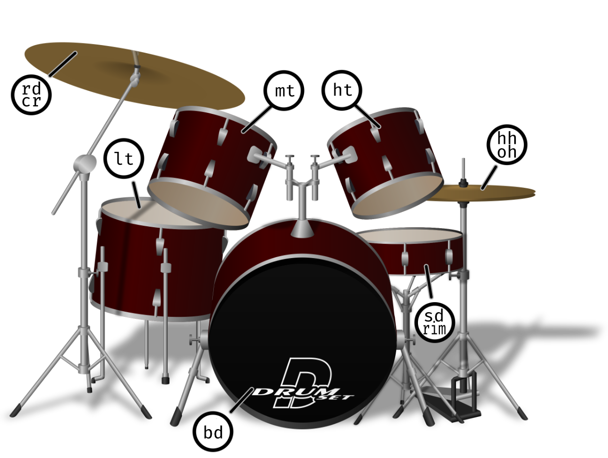

# notes with strudel
Learning how to make some basic sounds for video games with the strudel repl:
https://strudel.cc/
a repl for making music with code in real time

Here is an example of a strudel beat I made before having any real idea what I was doing

<iframe
src="https://strudel.cc/#c2V0Y3BtKDIyKQokOiBuKGA8Clt%2BIDBdIDIgWzAgMl0gW34gMl0KW34gMF0gMSBbMCAzXSBbMCAxXQpbfiAwXSAzIFswIDNdIFt%2BIDNdClt%2BIDBdIDAgWzAgM10gWzAgMl0KPio4YCkuc2NhbGUoIkMyOm1pbm9yLCBFNTptaW5vciIpCi5zb3VuZCgiZ21fc3ludGhfc3RyaW5nc18xIGdtX3N5bnRoX2Jhc3NfMSwgZ21fc3ludGhfc3RyaW5nc18xIikKLmxwZigzMjAwKQoKJDogc291bmQoImJkKjQsIFt%2BIDxzZCBjcD5dKjIsIFt%2BIGhoXSo0IikKLmJhbmsoImFjZSIpCgovLyBjcmF6eSBkcnVtcwokOiBzb3VuZCgiPDxbYmQqNCx%2BIHJpbSB%2BIGNwXS88MSBbMSAyXT4sIFtiZCo0LH4gcmltIH4gY3BdKjwxIFsxIDJdPj4sIDxbYmQqNCx%2BIHJpbSB%2BIGNwXS88MSBbMSAyXT4gW2JkKjQsfiByaW0gfiBjcm93XSo8MSBbMiA4XT4%2BPiIp"
  width="600"
  height="300"
></iframe>

I will try and carefully go through the tutorials in order and make some proper mockup of the notes for a better guide on what is possible.
## First sounds
Use `s("<sound-id>")` for playing any sound like `s("casio")`

<iframe
  src="https://strudel.cc/#CnMoImNhc2lvIik%3D"
  width="600"
  height="300"
></iframe>

Add a number to play a specific sample in that sound like `s("casio:2")`
<iframe
  src="https://strudel.cc/#CnMoImNhc2lvIik%3D"
  width="600"
  height="300"
></iframe>

### Drum sounds

For sample packs with percussion you can directly map samples to what's on a drumset

<iframe
src="https://strudel.cc/#CnMoImJkIHNkIHJpbSBoaCBvaCBvaCBsdCBtdCBodCByZCBjciIpCg%3D%3D"
  width="600"
  height="300"
></iframe>
